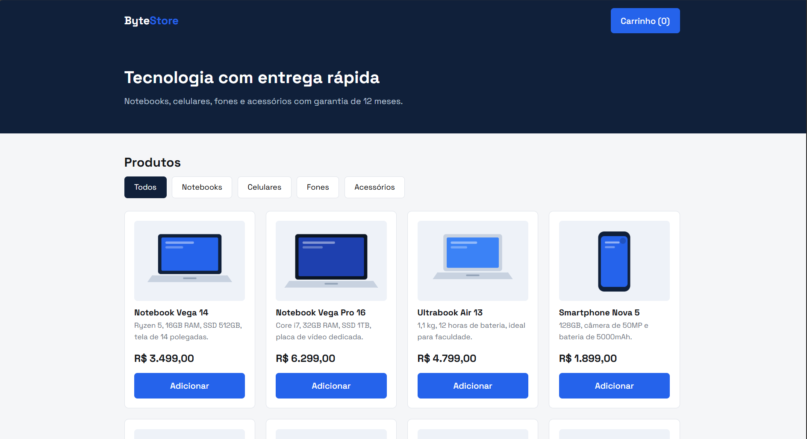
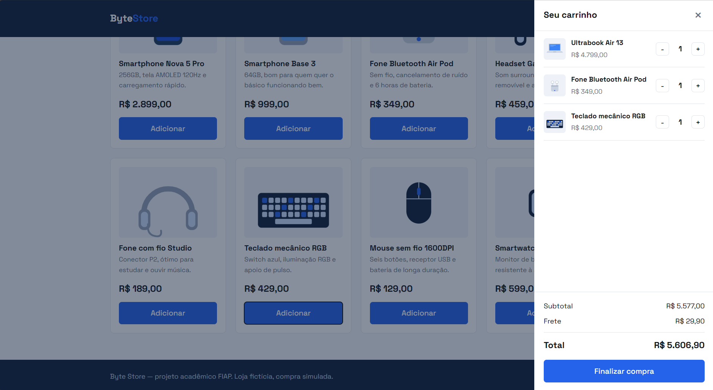

# Byte Store — E-commerce Colaborativo

Loja virtual de produtos de tecnologia (notebooks, celulares, fones e acessórios), feita com
HTML5, CSS3 e JavaScript puro. Toda a navegação, o carrinho e o fechamento de compra funcionam
no navegador, sem back-end.

**Aluno:** Arthur Veiga Demétrio — RM 570056
**Projeto publicado:** https://byte-store.vercel.app
**Repositório:** https://github.com/arthurdemetrio007-lgtm/byte-store

---

## Como funciona

- **Categorias e produtos dinâmicos.** Nenhum produto está escrito no HTML. As 5 categorias e os
  12 produtos estão em arrays no `script.js` e são desenhados na tela pelo JavaScript.
- **Filtro por categoria.** Clicar em uma categoria filtra a lista com `filter()`.
- **Carrinho.** Adicionar produtos, aumentar e diminuir a quantidade e remover. O subtotal e o
  total são calculados com `reduce()`.
- **Frete.** Valor fixo de R$ 29,90.
- **Checkout simulado.** Resumo do pedido, formulário com validação de nome, e-mail, CEP e forma
  de pagamento, e tela de confirmação com número de pedido. Nenhum pagamento é processado.
- **Responsivo.** Funciona de 320px até desktop.

---

## Arquivos

```
.
├── index.html    # estrutura da página
├── style.css     # todo o visual
├── script.js     # dados, catálogo, carrinho e checkout
└── README.md
```

O `script.js` está dividido em quatro blocos comentados: Dados, Catálogo, Carrinho e Checkout.

---

## Estratégia de layout CSS

O projeto usa **CSS Grid** e **Flexbox** juntos, cada um onde funciona melhor.

**CSS Grid** monta a grade de produtos:

```css
.grade {
  display: grid;
  grid-template-columns: repeat(auto-fill, minmax(220px, 1fr));
  gap: 20px;
}
```

Com essa única linha o catálogo mostra 4 colunas no desktop, 2 no tablet e 2 no celular, sem
precisar escrever uma media query para cada tamanho de tela. O `minmax(220px, 1fr)` garante que a
coluna nunca fica menor que 220px, e o `auto-fill` calcula sozinho quantas colunas cabem.

**Flexbox** alinha o conteúdo dentro dos blocos:

- **Cabeçalho:** logo de um lado e botão do carrinho do outro, com `justify-content: space-between`.
- **Card:** `flex-direction: column` e `flex: 1` na descrição, o que empurra o preço e o botão para
  o fim do card. Assim todos os cards da mesma linha terminam na mesma altura, mesmo com textos de
  tamanhos diferentes.
- **Carrinho:** coluna com o título fixo em cima, a lista de itens com `flex: 1` e `overflow-y: auto`
  (rola sozinha) e o resumo com o total fixo embaixo.
- **Categorias:** `flex-wrap: wrap` para os botões quebrarem linha no celular.

Resumindo: **Grid organiza os blocos na página, Flexbox alinha o conteúdo dentro de cada bloco.**

---

## Como rodar

Não precisa instalar nada. Baixe o repositório e abra o `index.html` no navegador.

```bash
git clone https://github.com/USUARIO/REPOSITORIO.git
```

---

## Prints

| Tela | Print |
|---|---|
| Página inicial |  |
| Carrinho |  |
| Checkout |  |
| Confirmação |  |

---

## Aviso

Loja fictícia, feita para fins acadêmicos. Produtos, preços e pedidos são simulados.
